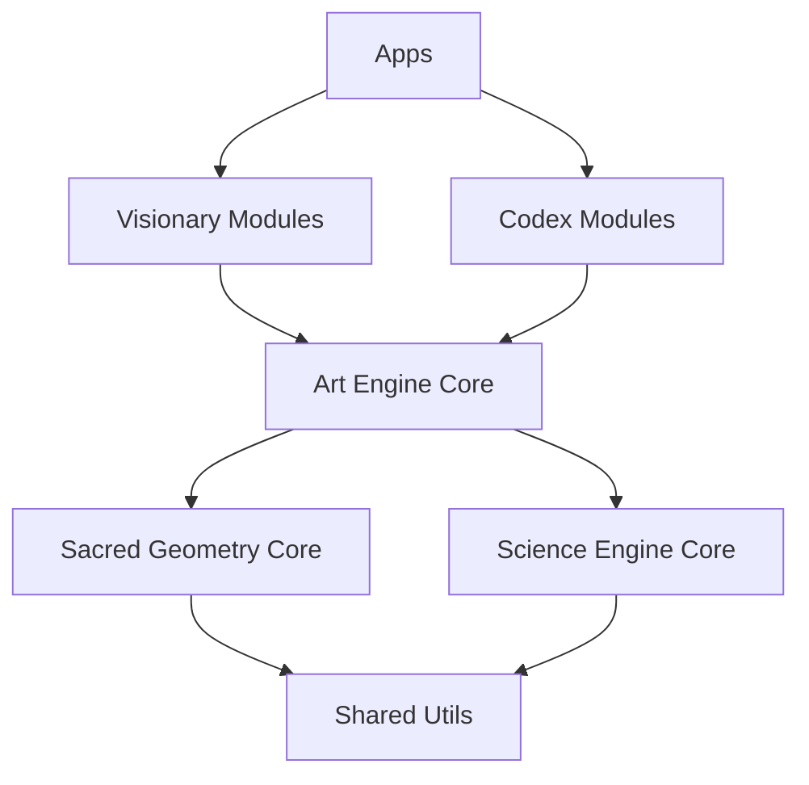

# Cathedral of Circuits: Grand Architectural Map
> *Magnum Opus v1 | Gold Standard A+ Enterprise Edition*

## 🌟 Vision
A unified, living monorepo ("The Cathedral") that integrates Art, Science, and Mysticism into a single, high-performance computational organism.

## 🏗️ Structure & Modes
The codebase is organized into **Tech Modes**, each representing a specific dimension of the Cathedral.

| Mode | Symbol | Focus | Key Modules |
| :--- | :---: | :--- | :--- |
| **VISIONARY** | 👁️ | UI, Frontend, Portals | `cathedral-of-circuits`, `holographic-interface` |
| **ART** | 🎨 | Audio, Visuals, Creative | `art-engine-core`, `stone-grimoire`, `liber-arcanae` |
| **SCIENCE** | ⚗️ | Math, Logic, Physics | `sacred-geometry-core`, `circuitum99-core` |
| **SYNTHESIZING** | 🔗 | Bridges, Integration | `tesseract-bridge`, `cathedral-integration` |
| **CODEX** | 📜 | Documentation, Archives | `codex-144-99`, `living-library` |

## 🛠️ Tech Stack ("The Engine")
-   **Core**: TypeScript, Node.js (v20+), pnpm Workspaces.
-   **Build**: TurboRepo 2.0 (High-performance caching).
-   **Art/Game**: Godot 4.5 + Rust (GDExtension) for high-performance creative visuals.
-   **Web**: React, Vite, Canvas API.

## 🚀 Deployment ("The Transmission")
-   **Strategy**: Platform-Agnostic, Self-Hosted Freedom.
-   **Primary Target**: Coolify (Docker-based).
-   **CI/CD**: GitLab CI (Source of Truth) -> GitHub (Mirror).
-   **Policies**:
    -   No Vendor Lock-in (Vercel/Netlify optional).
    -   "Safari First" Compatibility (Older Macs supported).
    -   Zero-Cost Operation (Free Tier optimized).

## 🔮 Dependency Graph (Simplified)

## 🛡️ Security & Integrity
-   **Git Hygiene**: Clean history, single `origin` (GitLab), strictly managed remotes.
-   **Trauma-Safe**: UI/UX designed with `noAutoplay`, `gentleDefaults`, and `undoRedo`.
-   **Sacred Math**: All visual algorithms validated against Golden Ratio (1.618) standards.

---
*Generated by Antigravity | Cathedral Architect Agent*
